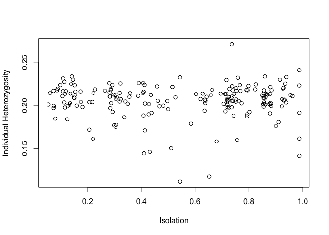
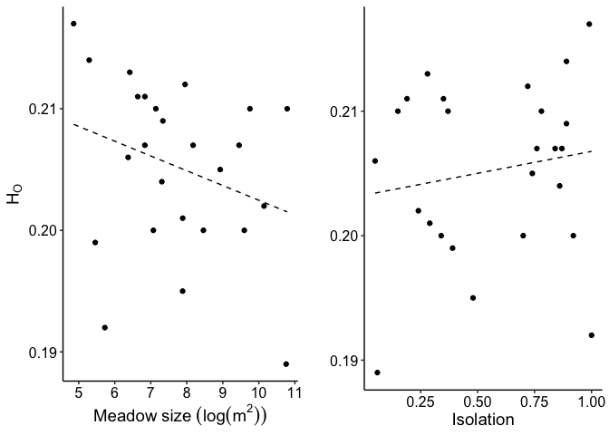

Basic population genetics stats and plotting
================
Dusty Gannon
Dec 2021

## Load data

``` r
  load(
    here(
      "Data",
      "Indiv_lndscp_gen.RData"
    )
  )

# additional information
  samps_dat_all <- read.table(
    here(
      "Data",
      "sequenced_samples.txt"
    ),
    header = T,
    sep = "\t"
  )
```

## Individual level statistics

``` r
obs_het_samps <- Ho_ind(col_alLD)
summary(obs_het_samps)
```

    ##    Min. 1st Qu.  Median    Mean 3rd Qu.    Max. 
    ##  0.1117  0.1995  0.2088  0.2055  0.2168  0.2708

``` r
## Sanity check
# all.equal(samp_dat_sub$Sample, rownames(col_alLD))

samp_dat_sub$het <- obs_het_samps

# png(
#   filename = here("Figures", "ind-het_by_iso.png"),
#   height = 1200,
#   width = 1500,
#   units = "px",
#   res=300
# )
  plot(
    obs_het_samps~samp_dat_sub$PROP_FOREST_100M_PL, 
    xlab="Isolation", 
    ylab="Individual Heterozygosity"
  )
```

<!-- -->

``` r
# dev.off()
```

## General population genetic statistics

``` r
# Popgen summary
  col_popgen_L1 <- col_popgen_data[
    ,
    -which(
      names(col_popgen_data) %in% c(
        "Sample",
        "COMPLEX"
      )
    )
  ]

  mdw_summaries <- tibble(
    Ho = Ho(col_popgen_L1),
    He = He(col_popgen_L1, bias_correct = F),
    Fis = 1-(Ho/He)
  )
  
  mdw_summaries <- round(
    mdw_summaries, digits = 3
  )
  
# Get sample sizes
  mdw_summaries2 <- group_by(
    col_popgen_L1,
    MEADOW_ID
  ) %>% summarise(
    n=n()
  )
  
# get sampling strata
  strata <- group_by(samps_dat_all, MEADOW_ID) %>%
    summarise(
      stratum = unique(STRATUM)
    )
  
# create table for MS
  tab1 <- cbind(
    mdw_summaries2,
    mdw_summaries
  )
  
  tab1 <- merge(
    strata,
    tab1
  )

# meadows and complexes
  comps <- unique(
    samp_dat_sub[
      ,
      which(names(samp_dat_sub) %in% c(
          "COMPLEX",
          "MEADOW_ID"
        )
      )
    ]
  )
  
  tab1 <- merge(
    tab1,
    comps
  )
  
# sort
  tab1 <- tab1[
    order(tab1$COMPLEX, tab1$stratum),
  ]
  
  names(tab1) <- c(
    "Meadow ID",
    "Sampling stratum",
    "Individuals genotyped",
    "$H_o$",
    "$H_e$",
    "$F_{IS}$",
    "Complex"
  )
  
  
  # write_csv(
  #   tab1[,-ncol(tab1)],
  #   file = here(
  #     "Data", "basic_popgenstats.csv"
  #   )
  # )
  
# merge in landscape data
  mdw_dat <- group_by(samp_dat_sub, MEADOW_ID) %>%
    summarise(
      size = log(mean(MEADOW_AREA)),
      isol = mean(PROP_FOREST_100)
    )
  
  popgen_summary <- merge(
    tab1,
    mdw_dat,
    by.x = "Meadow ID",
    by.y = "MEADOW_ID"
  )
  
  names(popgen_summary) <- c(
    "meadow",
    "stratum",
    "n",
    "Ho",
    "He",
    "FIS",
    "complex",
    "size",
    "isol"
  )
```

## Some basic plots (included as supplementary material)

``` r
# create theme
  ho_plot_theme <- theme(
    panel.background = element_blank(),
    axis.line = element_line(colour = "black"),
    axis.text = element_text(
      size = 12,
      color = "black"
    ),
    axis.title = element_text(
      size = 14
    )
  )
  
# Ho against meadow size
  p1 <- ggplot(aes(x=size, y=Ho), data = popgen_summary) +
    geom_point()+
    geom_smooth(
      method = "lm", 
      se=F, 
      color="black", 
      linetype="dashed",
      size=0.5
    )+
    ho_plot_theme+
    xlab(expression(Meadow~size~(log(m^2))))+
    ylab(expression(H[O]))
    
# Ho against isolation
  p2 <- ggplot(aes(x=isol, y=Ho), data = popgen_summary) +
    geom_point()+
    geom_smooth(method = "lm", 
                se=F, 
                linetype="dashed",
                size=0.5,
                color="black")+
    ho_plot_theme+
    xlab("Isolation")+
    ylab("")
  
# uncomment to save plot
  
  # png(here("Figures", "Ho_plots.png"), 
  #     height = 900, width = 2100, units = "px", res=300)
     gridExtra::grid.arrange(p1, p2, nrow=1)
```

    ## `geom_smooth()` using formula 'y ~ x'
    ## `geom_smooth()` using formula 'y ~ x'

<!-- -->

``` r
#  dev.off()
```
